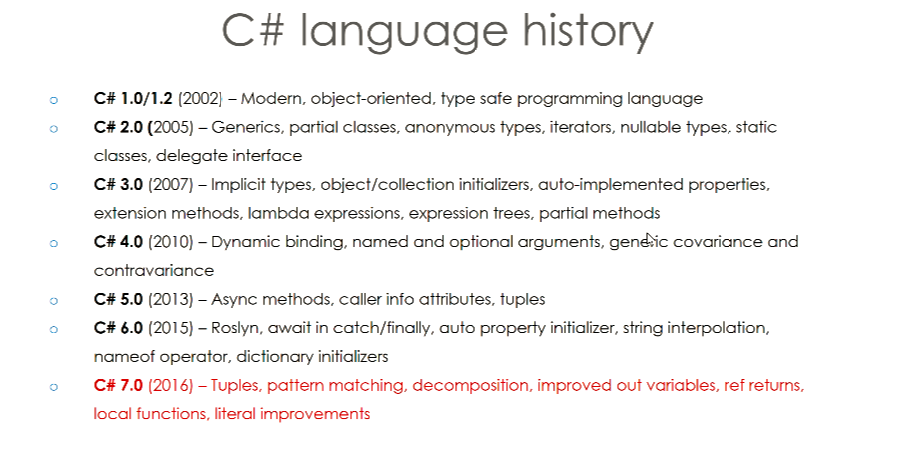

# History of .NET and C# 28/04.2020

### What is C#?
- C# is a object-oriented programming language developed by Microsoft in 2002 
- It is general purpose and can be used for windows desktop applications and games but is becoming increasingly popular for mobile development too. 

### C# Versions
There are currently 7

